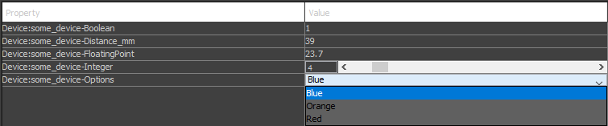

## Summary

<table>
<tr>
<td markdown="1">

**Summary:**

</td>
<td markdown="1">

Device adapter for the integration of Python objects in MicroManager

</td>
</tr>
<tr>
<td markdown="1">

**Author:**

</td>
<td markdown="1">

Ivo Vellekoop and Jeroen Doornbos

</td>
</tr>
<tr>
<td markdown="1">

**License:**

</td>
<td markdown="1">

BSD-3

</td>
</tr>
<tr>
<td markdown="1">

**Devices:**

</td>
<td markdown="1">

Stage, XYStage, Camera, Generic device

</td>
</tr>
</table>


# Introduction
PyDevice is an adapter that imports objects from a Python script, and integrates them into MicroManager as devices (e.g. a camera or a stage). This integration enables the use of Python scripts to control microscope hardware, without requiring any programming experience from the end user. Essentially, PyDevice acts as a translator, allowing Python-developed objects to be used in MicroManager with almost no interfacing code required.

# Getting started
## Requirements
To use PyDevice, the following software needs to be installed:

* **Windows 10 or 11**. PyDevice was developed and tested in Windows. Although it _should_ work on Linux, this is not tested. Please contact the developers if you are interested in testing and using PyDevice in Linux.

* **Python 3.9 or higher**. PyDevice will use the Python installation it finds through the system **PATH** variable. We will refer to this as the *main* Python install. To check if Python is installed correctly, open a command prompt and type `python --version`. 

* **`numpy` and `astropy`** Python packages. These packages should be installed in the main Python install, or in the virtual environment that is used to run the script (see below). We recommend using the Anaconda distribution, which has these packages installed by default. Otherwise, use `pip` to install them.

# Documentation & examples
Examples of Python scripts that can be loaded by PyDevice can be found in:

- https://github.com/micro-manager/mmCoreAndDevices/tree/main/DeviceAdapters/PyDevice, this contains simple example devices that show the requirements of the Python objects.

- https://github.com/IvoVellekoop/openwfs/tree/master/openwfs/devices, A more extensive repository containing the simple examples and actual implementations, like a laser scanning object.

    it can soon also be installed & imported as the PyPI package OpenWFS:

        pip install OpenWFS
    
    and for use:
    
        from OpenWFS.devices.example_camera import Camera
        devices = {'cam': Camera()}
    

# Using existing devices
To use a Python device, add `PyDevice` in the hardware configuration manager. This will open the following screen:


**ScriptPath** is the path to the Python script that constructs the device objects. The requirements for writing a device script are described in the section *Developing new components*. When the ScriptPath is left blank (recommended), a file browser pops up when you select `OK`, so that you can select the script through the GUI.

**ModulePath** is the search path that Python will use to load packages/modules. When set to the default value of `(auto)` (recommended) PyDevice will automatically detect if the loaded script is in a virtual environment, and if one is found, attempts to load the modules from that virtual environment first before searching in the `site-packages` folder of the main Python install. Optionally, a module search path may be added manually. Multiple path names should be separated by a semicolon.

PyDevice now loads and executes the Python script. All recognized devices can now be selected, and later configured through the Property Browser. For example, when selecting the `example_camera.py` script, the following screen is shown:


Where you can select the camera so that it is imported as a device in MicroManager. Currently, PyDevice automatically recognizes `Camera`, `Stage`, `XYStage` and generic `Device` object types. These objects are transformed into compatible MicroManager objects.

# How it works
## Basics
PyDevice runs its own Python interpreter and executes the selected script. The script should set up a variable `devices`, which contains a dictionary of all objects to be exposed as devices in MicroManager. For example:
    
    devices = {'cam': Camera()}
    
Will result in the creation of an object called `cam` in MicroManager, linked to an object of type `Camera` in Python. Loading multiple devices is done by adding more entries in the dict object:

    devices = {'cam': Camera(),'stage': XYStage()}

PyDevice scans the objects in the `devices` dictionary for public properties, and automatically exposes these properties in the MicroManager property browser. For example, the following code shows how to create an object that exposes a single property with the name `floating_point`.

    class GenericDevice:

        def __init__(self,floating_point):
            self._floating_point = floating_point
            
        @property
        def floating_point(self) -> float:
            return self._floating_point
    
        @floating_point.setter
        def floating_point(self, value):
            self._floating_point = value

        
    devices = {'some_device': GenericDevice(2.5)}
    
Which will appear in MicroManager as:


As can be seen here, the naming conventions will also be adapted. Properties that follow Python's snake_case convention will be transformed into tghe CamelCase convenstion used in MicroManager.

## Property types
PyDevice recognizes public properties of the types `int`, `float`, `str`, as well as `Enum`'s and quantities with an `astropy` unit. In order to expose a propety to MicroManager, the property should have a getter with the appropriate type hint. To have a property that can be modified from MicroManager, also a setter has to be provided, as illustrated in the examples below.

- **`int` type hint:**
  Properties annotated with the `-> int` type hint are exposed as integer properties in MicroManger:

  ```python
  @property
  def x(self) -> int:
      return self._x

  @x.setter
  def x(self, value):
      self._x = int(value)
  ```
  

- **`float` type hint:**
  Properties annotated with the `-> float` type hint are exposed as floating point properties in MicroManger:

  ```python
  @property
  def floating_point(self) -> float:
      return self._floating_point

  @floating_point.setter
  def floating_point(self, value):
      self._floating_point = float(value)
  ```

  Note: MicroManager does not support `None` values, but they may be useful to indicate that a parameter is not set. As a workaround for floating point properties and floating point properties with a unit of measure, a `None` in Python is converted to a `nan` in MicroManager, and vice-versa. Other property types cannot be set to `None`


- **`str` type hint:**
  Properties annotated with the `-> str` type hint are exposed as textual properties in MicroManger:

  ```python
  @property
  def command(self) -> str:
      return self._command

  @command.setter
  def command(self, value):
      self._command = str(value)
  ```

- **`bool` type hint:**
  The annotation, `-> bool` is used for properties that are meant to represent binary states (`True`/`False`). Booleans are represented as `0` or `1` in the MicroManager GUI.

  ```python
  @property
  def boolean(self) -> bool:
      return self._boolean

  @boolean.setter
  def boolean(self, value):
      self._boolean = bool(value)
  ```

- **Enum type hints:**
  Any class that subclasses `Enum` can be used as a type hint for a property. These properties are converted to drop-down menus in the property browser.

  In the example below, the type hint specifies that the `options` property can only take values defined in the `SomeOptions` enumeration. This restriction guarantees that users can only set `options` to either `Orange`, `Red`, or `Blue`.

  ```python
  from enum import Enum

  class SomeOptions(Enum):
      Orange = 1
      Red = 2
      Blue = 3

  @property
  def options(self) -> SomeOptions:
      return self._options

  @options.setter
  def options(self, value):
      self._options = value
  ```

- **Astropy unit type hint:**
    The `astropy.unit` package makes it possible to attach units to numerical variables in Python. The enforcement of units avoids confusion, and setting this property with a differently scaled unit (e.g. nanometers instead of micrometers) will automatically adjust the scaling appropriately. The astropy unit package also handles unit multiplication, e.g.
    ```
    a = 3 * u.m / u.s
    b = 2 * u.s
    print(a*b)
    ```
    will correctly output `6.0 m`. 
    
    PyDevice recognises Atropy units, and appends the suffix `_{unit}` to the property name used in MicroManager. The use of unit annotations is highly recommended if possible, and it is required for some of the properties of camera's and stages, see below.

    ```
    import astropy.units as u
    
    @property
    def distance(self) -> u.Quantity[u.mm]:
        return self._distance

    @distance.setter
    def distance(self, value):
        self._distance = value.to(u.mm)
    ```
    

- **Specifying ranges:**
  `Annotated[int, {'min': 0, 'max': 42}]` goes beyond a simple integer type hint by specifying a range. This annotation tells MicroManager that `integer` is not just any integer but must fall within the specified range (0 to 42). It's particularly useful for setting safety limits on device properties to prevent hardware damage or other errors.
  
  `Annotated` can be used for integers, floats and units. `int` can also be used without `Annotated`.

  ```python
  from typing import Annotated

  @property
  def integer(self) -> Annotated[int, {'min': 0, 'max': 42}]:
      return self._integer

  @integer.setter
  def integer(self, value):
      self._integer = value
  ```

Combining these property in an example device, produces the following GUI in MicroManager:

     

## Developing new components:
In order to expose Python object as a device in MicroManager, the class should have one or more annotated public properties, as described above, and the script should create the object and include it in the `devices` dictionary.

In addition, when PyDevice loads the Python objects, it checks if they match the requirements to be exposed as a camera, stage, or xystage. This inspection is done using the script `bootstrap.py`, which can be found in the PyDevice source repository, so for more detail; check this file. Examples of each implementation exists in the documentation folders. The file containing the templates is bootstrap.py

Specifically, the bootstrap script recognizes the following types of devices.

1. Device
2. Camera
3. Stage
4. XYStage

If a device implements the required properties and methods for a certain device class (see below for a description per device type), the object is automatically converted to the corresponding MicroManager device, and it can be used as a Camera, Stage, etc.


### Device
This is the default device type, if none of the requirements for a specific device are met, the device type will be set to this.

### Camera
Required properties:

    duration: Quantity[u.ms]
    top: int
    left: int
    height: int
    width: int

Duration is the exposure time of the camera. Binning is required in MicroManager, so if it is not present, a property `binning = 1` will be created. Height and Width are the dimensions of the images returned.

Required methods:

    trigger(self) -> concurrent.futures.Future

    
**Important note:** The trigger method needs to return an object with a method `result()` that returns an `uint16` numpy array of shape `(height,width)` containing the image data. This approach is compatible with the `concurrent.futures.Future` object in the standard Python library, and enables advanced scenarios for multi-threaded synchronization. See the OpenWFS repository for examples.
  When not using multi-threading, the simplest approach is to create a `Future` object, call `set_result(data)` to store the data in the object, and return the `Future` from the `trigger` method.


### Stage
Required properties:

    step_size: Quantity[u.um]
    position: Quantity[u.um]
    
Setting the position should cause the stage to move. Overwriting this attribute while the stage is moving should cause it to start moving to the new position. 

Required methods:

    home(self) -> None
    busy(self) -> bool
    
`busy` should return True if moving, this should include any time the stage may 'vibrate' after stopping. `home` should set the stage to a home. For example x & y = 0

### XYStage
Required properties:

    x: Quantity[u.um]
    y: Quantity[u.um]
    step_size_x: Quantity[u.um]
    step_size_y: Quantity[u.um]
    
Setting the positions should cause the stage to move. Overwriting this attribute while the stage is moving should cause it to start moving to the new position. 

Required methods:

    home(self) -> None
    busy(self) -> bool

`busy` should return True if moving, this should include any time the stage may 'vibrate' after stopping. `home` should set the stage to a home. For example x & y = 0

# Call for collaborations
We would like to set up a database containing implementations of hardware control scripts, simulated devices, wavefront shaping algorithms, and other re-usable scripts. Our current collection of devices is included in the OpenWFS repository. If you would like to contribute; please contact i.m.vellekoop@utwente.nl.

# Troubleshooting
If an error occurs in the Python script, that error is displayed in the MicroManager GUI, and logged in the CoreLog if logging is enabled in MicroManager. Often, the error is helpful in finding what whent wrong, and in correcting the Python script. For more complicated problems, we recommend testing the Python script in a Python IDE and using the associated debugger. Due to the way the MicroManager / Python bridge is set up, it is always possible to execute the script that creates the device objects as a stand-alone script.

Common sources of error are:
* **An object is not recognised as a Camera/Stage/etc.**. This happens when not all required properties and methods are implemented (see a description of the required attributes above). Due to a current limitation in the implementation, it is not possible to inherit the required properties from a super class. All properties should be *implemented explicitly*.

* **An error occurs when reading a property set to None**. Currently, MicroManager does not support missing values for properties. Instead, if `None` is found in a float property, it is silently converted to `nan`. For other property types, if the getter returns `None`, an error is given.

* **A property does not show up in MicroManager**. This is typically caused by a missing type annotation. Also note that properties should have an explicit 'getter', in the form of a `@property` decorator, see examples above. 


