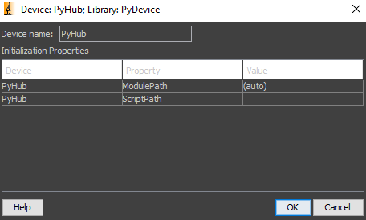

| | |
|:------------|:--------------------------------------------------------------------|
| **Summary** | Device adapter for the integration of Python objects in MicroManager |
| **Author**  | Ivo Vellekoop and Jeroen Doornbos                                    |
| **License** | BSD-3                                                               |
| **Devices** | Stage, XYStage, Camera, Generic device                               |


# PyDevice

PyDevice is a Micro-Manager device adapter that loads Python scripts as Micro-Manager devices. PyDevice is currently **experimental**. It may still change significantly, and it is not fully tested under all circumstances. Please feel free to try it out and provide feedback.

## Getting started

The easiest way to use PyDevice is to install the latest nightly build of Micro-Manager 2.0 and check if the PyDevice
plugin is included. You can download the latest version here: https://micro-manager.org/Micro-Manager_Nightly_Builds.
Alternatively, you can build the device adapter from source, as described below. The steps below give a simple example
to get you started

1. Make sure you have **Python 3.9** or later installed on your system. Note: **the Python interpreter should be in your system path**, which you can easily check by typing `python` in a command prompt. PyDevice also requires **numpy** to be installed, either in the base Python install, or in a virtual environment (see [Virtual environments](#virtual-environments) for more information).

2. Create a script that defines a class with properties and methods that you want to use in Micro-Manager. For example, create a file `hello_device.py` with the following content:

```python
class HelloDevice:
    def __init__(self):
        self._message = "Hello, World!"

    @property
    def message(self) -> str:
        return self._message

    @message.setter
    def message(self, value):
        self._message = value


devices = {'hello': HelloDevice()}
```

3. In Micro-Manager, create a new hardware configuration. In the Hardware Configuration Wizard select `PyDevice->PyHub` from the list of devices and `Add` the device. You should now see the following screen



4. There is no need to set the `ModulePath` or `ScriptPath` properties of the `PyHub` device . Instead, just press `Ok` to get a file browser dialog. Select the `hello_device.py` script you just created. This will execute the script and import all objects in the `devices` dictionary into Micro-Manager. You will now see a list of the objects that were successfully recognized, similar to the following screen:


5. Select the device to add it to the configuration. Optionally, change the label from `Device:hello` to anything you like, and press `Ok` to close the dialog.

6. Complete the rest of the wizard, add other devices if you want. Note, however, that there can only be a single PyHub device, and thus a single Python script, in a configuration. This script, however, can define as many devices as needed by adding them to the `devices` dictionary.

If all went well, you should now see the device in the Device Property Browser, with one property `Message`, that you can modify.

## How does it work?

The PyDevice device adapter runs a Python interpreter in which the Python script is executed. It then looks for a dictionary called `devices`, and adds the objects in this dictionary as devices to Micro-Manager.

To make a property available in Micro-Manager, it should be public (not `_`-prefixed), and declared with the `@property` decorator, as shown in the example. Moreover, the property getter should have a type annotation for the return value (`-> str`), so that PyDevice can determine the type of the property. PyDevice supports `str`, `int`, `float`, `bool`, as well as `Enum` types and floats with units (see [Advanced use](#advanced-use)). If you want to make the property writable, you should also define a setter method (`@message.setter` in the example). 

Note that the property name was converted from `message` to `Message` in Micro-Manager to comply with the naming conventions in both Python and Micro-Manager. Also note that, except for the construction of the dictionary object, there is no special code to interact with Micro-Manager. The Python script can be used and tested independently of Micro-Manager.


## Other device types

It is also possible to define other device types. PyDevice will automatically detect the device type by examining the properties and methods present on the object. Currently, the following device types are supported:

- `Camera`: requires the following properties and methods:
    - `exposure_ms` (float): the exposure time in milliseconds
    - `top` (int): the top coordinate of the region of interest
    - `left` (int): the left coordinate of the region of interest
    - `width` (int): the width of the region of interest
    - `height` (int): the height of the region of interest
    - `binning` (int): the binning factor. This property is optional, and defaults to 1
    - `read()` (method): acquire an image and return it as a numpy array
    - `busy()` (method): return `True` if the camera is busy acquiring an image

- `Stage`: requires the following properties and methods:
    - `position_um` (float): position of the stage in micrometer
    - `step_size_um` (float): step size of the stage in micrometer
    - `home()` (method): move the stage to the home position and reset the position to (0)
    - `busy()` (method): return `True` if the stage is moving

- `XYStage`: requires the following properties and methods:
    - `x_um` (float): position of the stage in micrometer
    - `y_um` (float): position of the stage in micrometer
    - `step_size_x_um` (float): step size of the stage in micrometer
    - `step_size_y_um` (float): step size of the stage in micrometer
    - `home()` (method): move the stage to the home position and reset the position to (0, 0)
    - `busy()` (method): return `True` if the stage is moving

For examples of how to define devices, see the `examples` directory in the GitHub repository.

## Use with `openwfs`
PyDevice was developed to integrate seamlessly with our [OpenWFS](https://openwfs.readthedocs.io) package for controlling wavefront shaping experiments. This package provides a high-level interface to control spatial light modulators, cameras, and other hardware. For example, it includes code to control a **_scanning multiphoton microscope_** through a NI-daq data acquisition card. This code integrates directly as a `Camera` device in Micro-Manager. In addition, it includes code to **_simulate a motorized microscope_**, which allows you to try out Micro-Manager and PyDevice without any hardware. The code for these devices is available in the `openwfs` package, which can be installed with `pip install openwfs`.


## Use in `pymmcore`
PyDevice can be used in [pymmcore](https://github.com/micro-manager/pymmcore) just as any other device adapter. For example, to load a configuration file `camera.cfg` that contains the definition of a camera device, and acquire an image, you can use the following code:

```python
import pymmcore
mmc = pymmcore.CMMCore()
mmc.setDeviceAdapterSearchPaths(["C:/Program Files/Micro-Manager-2.0/"])
mmc.loadSystemConfiguration("camera.cfg")
mmc.setProperty("cam", "Width", 121)
mmc.setProperty("cam", "Height", 333)
mmc.snapImage()
frame = mmc.getImage()
```

Using `pymmcore`, you can even debug the Python code, by simply setting a breakpoint in the code implementing the Device (tested in PyCharm 2024 with Conda 22.9 (Python 3.9)). This is actually quite remarkable as the device is running in a separate Python interpreter, and the debugger is attached to the main Python interpreter. 


## Troubleshooting
* **The plugin does not show up in Micro-Manager.** This may be because you have a version of Micro-Manager that does not have PyDevice included. 

* **The PyDevice plugin is shown in the list of device adapters, but it grayed out and cannot be loaded**. This happens if Python is not installed, or the Python install cannot be located through the `PATH` environment variable. Also, if you built PyDevice yourself, this problem can be caused by a version difference between MicroManager executable and the source code used to build PyDevice.

* **The plugin crashes when it tries to load a script.** To find out what is the exact problem, enable logging in Micro-Manager and examine the core log file. One of the reasons may be an incorrect configuration of the system path or the `PYTHONHOME` environment variable. We found that this can cause Anaconda distributions to crash under certain circumstances. Removing the `PYTHONPATH` and `PYTHONHOME` variables from the system environment variables, and making sure the directory holding `python3.dll` is included in the `PATH` system environment variable  may solve the problem.

* **My device script is recognized as `Device` instead of a `Camera`, `Stage`, etc.**. PyDevice determines the device type by examining the properties and methods of the object. If the object has all the required properties and methods of a `Camera`, it will be recognized as such. If the object is recognized as a `Device`, it means that one or more of the required properties or methods are missing. Check the spelling of the property names, and make sure that the property getters have the correct type annotation for the return value.

* **A property does not show up in MicroManager**. This is typically caused by a missing type annotation. Also note that properties should have an explicit 'getter', in the form of a `@property` decorator, see examples above. 

* **An object is not recognised as a Camera/Stage/etc.**. This happens when not all required properties and methods are implemented (see a description of the required attributes above). Due to a current limitation in the implementation, it is not possible to inherit the required properties from a super class. All properties should be *implemented explicitly*.

* **An error occurs when reading a property set to None**. Currently, MicroManager does not support missing values for properties. Instead, if `None` is found in a float property, it is silently converted to `nan`. For other property types, if the getter returns `None`, an error is given.

* **MicroManager crashes when the plugin is loaded**. This behavior was observed when an incorrectly configured Anaconda installation was used. If the base packages for the the Python library cannot be found in the folder containing `python3.dll`, the Python runtime exits the current process. Unfortunately, there currently is no way to have the Python runtime just report an error. As a solution, make sure Python is installed correctly and can be run from the command prompt.


## Advanced use
### astropy.units
Some of the properties that PyDevice expects are specified in milliseconds or micrometers (indicated by the `_ms` or `_um` suffix). As an alternative to using plain floats, you can use the `astropy.units` package to specify the units of the property. For example, the `exposure_ms` property in the `Camera` device can be defined as follows:

```python
from astropy import units as u

class Camera:
    def __init__(self):
        self._exposure = 10 * u.ms
        
    @property
    def exposure(self) -> u.Quantity[u.ms]:
        return self._exposure * u.ms

    @exposure.setter
    def exposure(self, value):
        self._exposure = value.to(u.ms)

    ...
```
PyDevice detects properties of type `astropy.units.Quantity` and automatically converts them to properties of the name `Exposure-ms`, etc. in Micro-Manager. Currently, the following units are recognized: s, ms, us, ns, m, cm, mm, um, nm, A, mA, uA, V, mV, uV, Hz, kHz, MHz, GHz. The benefit of using this approach is that the user can specify the exposure time in the units they prefer (e.g. `camera.exposure = 1 * u.s`), with astropy taking care of the unit conversion.

### Enum types
PyDevice supports properties with Enum types. For example, the following code defines a property `color` with an Enum type:

```python
from enum import Enum
class Color(Enum):
    Orange = 1
    Red = 2
    Blue = 3
    
class DeviceWithColor:

    def __init__(self, color):
        self._color = color

    @property
    def color(self) -> Color:
        return self._color

    @color.setter
    def options(self, value):
        self._color = value
```
PyDevice will detect that the `color` property returns an Enum, and create a property `Color` in Micro-Manager with the options `Orange`, `Red`, and `Blue` shown in a drop-down box.

### Actions
`Camera` objects define a method to read a frame, and `Stage` and `XYStage` devices define methods to home the stage. These actions are started by Micro-Manager. Currently, there is no direct support for user-defined actions that can be started from the GUI. As a work-around, one can define a property that triggers an action when set. For example, the following code defines a property `capture` that triggers the `read` method of the `Camera` object:

```python
from enum import Enum
class Action(Enum):
    Idle = 0
    Do_A = 1
    Do_B = 2
    Do_C = 3
    
class DeviceWithActions:
    @property
    def action(self) -> Action:
        return Action.Idle

    @action.setter
    def options(self, value):
        if value == Action.Do_A:
            self.do_A()
        elif value == Action.Do_B:
            self.do_B()
        elif value == Action.Do_C:
            self.do_C()

    ...
```
The user can now select an action from a drop-down box in Micro-Manager to activate the device.


### Virtual environments
PyDevice requires the Python installation to be findable by the system. Concretely, when Micro-Manager loads the device adapter, Windows searches for the file `python3.dll` the system path and other locations. It will then load that dll, and use the Python installation from the same directory.

Other than changing the PATH environment variable, there is currently no way of selecting which Python installation to use. It is, however, possible to specify where Python should look for installed packages. This is particularly useful when using virtual environments. If `ModulePath` is set to the default value of `(auto)`, PyDevice will look in all parent folders of the loaded script for a `venv` directory. If this directory is found, the `venv/Lib/site-packages` folder will be added to the Python `sys.path`, so that the script can load packages installed in the virtual environment.

If your virtual environment is located in a different location, you can specify the `ModulePath` property of the `PyHub` device. This property should point to the `site-packages` directory of the virtual environment. For example, Poetry stores the virtual environments in `C:\Users\{username}\AppData\Local\pypoetry\Cache\virtualenvs\{virtual-environment-name}\Lib\site-packages`.

### Specifying ranges (experimental!)
  `Annotated[int, {'min': 0, 'max': 42}]` goes beyond a simple integer type hint by specifying a range. This annotation tells Micro-Manager that the property is not just any integer but must fall within the specified range (0 to 42). It's particularly useful for setting safety limits on device properties to prevent hardware damage or other errors.
  
  `Annotated` can be used for integers and floats.

  ```python
  from typing import Annotated

  @property
  def integer(self) -> Annotated[int, {'min': 0, 'max': 42}]:
      return self._integer

  @integer.setter
  def integer(self, value):
      self._integer = value
  ```

## Known limitations
* PyDevice was developed and tested on Windows. If you are interested in porting the plugin to Linux, please contact the developers.
* PyDevice needs `numpy` to be installed in the Python environment, and `Camera` objects must use `numpy` arrays to return the data. This limitation may be eliminated in the future by using the new buffer protocol in Python. However, this protocol is only part of the stable API since Python 3.11, it would force the users to upgrade their Python installation.
* Virtual environments are not fully supported (see above). This is because the Python C API loads the `python3.dll` directly when the PyDevice dll is loaded, and it is not possible to specify from which location the dll is loaded. This may be solved with a delay-loaded dll, but this does not seem to be supported by the Python C API.
* It is not yet possible to link an action to a push button in the GUI. 
* Only a single PyHub device can be active at a time. If you want to combine multiple Python devices, just create a single Python scripts that collects all devices in a single `devices` dictionary.

## Building from source code
First, install the following prerequisites

* **Visual Studio with C++ build tools**.
  You can download the free Visual Studio Community edition
  here https://visualstudio.microsoft.com/free-developer-offers/. Make sure to include the c++ build tools during
  installation.
* **Python 3**.
  To build PyDevice, Python 3.9 or later and the `numpy` package need to be installed. The compiler looks for the Python installation in a folder `3rdpartypublic/Python`, where `3rdpartypublic` is located in the parent folder of the parent folder of `mmCoreAndDevices`. For example, if the repository is located in `c:\git\mmCoreAndDevices`, we expect to find the include file at `c:\3rdpartypublic\Python\include\Python.h`. Instead of installing Python in that folder directly, it is recommended to make a symbolic link to the Python install. First, open a terminal window with administrator privileges, and navigate to the `3rdpartypublic` directory. Then create the symbolic link to the Python install, e.g. `mklink /D Python C:\Users\{username}\anaconda3`. Note that you can build using any Python 3 installation, as long as the version is 3.9 or higher. No Python binaries are included in the distribution, and the compiled plugin will use the Python installation that is found in the system path.

* **Micro-Manager 2.0**
  You can download the latest version (nightly build) here: https://micro-manager.org/Micro-Manager_Nightly_Builds. Alternatively, you can build the micro-manager application from source, or use an older, stable, version. Note that Micro-Manager only recognizes plugins with the correct internal version number, so if the Mirco-Manager version is too old, it will not recognize the plugin.

### Building the plugin

1. Open the solution file `mmCoreAndDevices/Micro-Manager.sln` in Visual Studio
   If asked to convert to a newer version, press cancel.
2. Not all plugins will build correctly. To build just the PyDevice plugin, right-click the PyDevice in the Solution
   Explorer and select `build`.

### Debugging

To debug the plugin in Micro-Manager, select a `Debug` build configuration in Visual Studio. In addition, right-click
PyDevice in the solution explorer, and `Set as Startup Project`. Right-click again and edit the PyDevice project
Properties, under Debugging, fill in the following settings:

|                   |                                                         |
|-------------------|---------------------------------------------------------|
| Command           | $(ProjectDir)/debug_helper.bat                          |
| Command Arguments | $(TargetPath)                                           |
| Environment       | MM_EXECUTABLE_PATH="C:\Program Files\Micro-Manager-2.0" |

Here, adjust the `MM_EXECUTABLE_PATH` if you installed Micro-Manager somewhere else. Finally, in the menu select `Debug->Other Debug Targets->Child Process Debug Settings...` and tick `Enable child process debugging`.
You can now press F5 to build and install the plugin, and start Micro-Manager with the debugger attached. Note: you can safely ignore the segmentation faults occurring in the Java virtual machine.

For device scripts, we recommend debugging and testing the scripts outside Micro-Manager first. The scripts should simply as standalone Python scripts, since they do not contain any Micro-Manager specific code. This way, you can test the scripts in an environment that is easier to debug and test. After testing the devices, you can also load them in `pymmcore` to test the interaction with Micro-Manager while maintaining the ability to debug the Python code.


